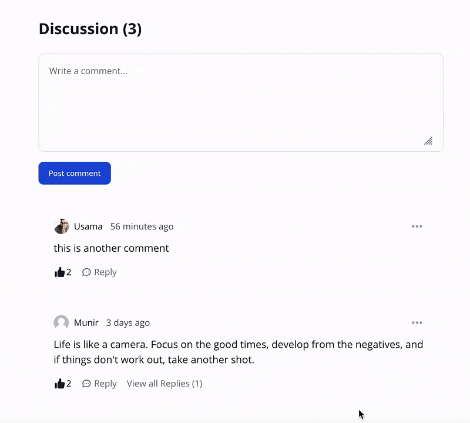

## Commentify - Laravel Livewire Comments

[](https://packagist.org/packages/usamamuneerchaudhary/commentify)
[](https://scrutinizer-ci.com/g/usamamuneerchaudhary/commentify/?branch=main)
[](https://www.codefactor.io/repository/github/usamamuneerchaudhary/commentify)
[](https://scrutinizer-ci.com/g/usamamuneerchaudhary/commentify/build-status/main)
[](https://scrutinizer-ci.com/code-intelligence)
[](https://packagist.org/packages/usamamuneerchaudhary/commentify)
[](https://github.com/usamamuneerchaudhary/commentify/blob/HEAD/LICENSE.md)



## Introduction

Commentify is a powerful Laravel Livewire package designed to provide an easy-to-integrate commenting system for any
model in your Laravel application. Powered by Livewire, this package offers a seamless commenting experience with support
for both Tailwind CSS and Bootstrap 5, making it easy for users to engage with your content. With features like comment
sorting, pagination, reporting, emoji picker, and YouTube-style like/unlike buttons, this package is perfect for applications
that require robust commenting capabilities. Additionally, guest users can like and unlike comments based on their IP addresses.
Mentions can be used with "@" to tag specific users in replies and edits, while Markdown support allows for rich formatting
in comments. Whether you're building a blog, an e-commerce platform, or any other type of web application, Commentify is a
powerful tool for enhancing user engagement and collaboration.

## Features

- ✅ Easy to integrate
- ✅ Laravel 12+ support
- ✅ Livewire 4 support
- ✅ Livewire powered commenting system
- ✅ **CSS Framework Support**: Tailwind CSS and Bootstrap 5
- ✅ **Dark/Light/Auto Theme**: Automatic theme detection with manual override options
- ✅ Read-only mode (configurable via `config/commentify.php`)
- ✅ Add comments to any model
- ✅ Nested Comments
- ✅ **Comment Sorting**: Sort by newest, oldest, most liked, or most replied
- ✅ **Comment Reporting**: Users can report inappropriate comments with predefined reasons
- ✅ **Comment Moderation**: Require manual approval for comments before they appear on the frontend
- ✅ **Emoji Picker**: Rich emoji support for comments
- ✅ **Notifications**: Real-time notifications for comment events (database, email, broadcast)
- ✅ Temporary user comment bans (block users from commenting until a set date)
- ✅ Comments Pagination
- ✅ YouTube style Like/unlike feature
- ✅ Guest like/unlike of comments (based on `IP` & `UserAgent`)
- ✅ Mention User with @ in Replies/Edits
- ✅ Markdown Support
- ✅ **Filament Admin Panel**: Optional Filament integration for managing comments and reports
- ✅ Full language/translation support (publish and override as needed)
- ✅ Customizable views (publish and override as needed)
- ✅ Policy-based authorization for all comment actions

## Prerequisites

- PHP 8.2 or higher
- Laravel 12 or higher
- [Livewire 4](https://livewire.laravel.com/docs/installation)
- [AlpineJS](https://alpinejs.dev/essentials/installation) (included with Livewire 4)
- **CSS Framework** (choose one):
  - [Tailwind CSS v4](https://tailwindcss.com/) (default)
  - [Bootstrap 5](https://getbootstrap.com/)

## Installation Guide

You can install the package via composer:

```bash
composer require usamamuneerchaudhary/commentify
```

### Service Provider Registration

The service provider is **automatically discovered** in Laravel 12+ when installed via Composer from Packagist.

However, if you're using a local development setup (e.g., path repository with symlinks) or need to manually register it, add it to `bootstrap/providers.php`:

```php
<?php

return [
    App\Providers\AppServiceProvider::class,
    // ... other providers
    Usamamuneerchaudhary\Commentify\Providers\CommentifyServiceProvider::class,
];
```

> **Note:** For local development with symlinked packages, explicit registration in `bootstrap/providers.php` ensures migrations and other package resources are loaded correctly.

### Run Migrations

Once the package is installed, you can run migrations:

```bash
php artisan migrate
```

### Publish config, views, and lang files as needed

```bash
# Publish configuration file
php artisan vendor:publish --tag="commentify-config"

# Publish views (choose one based on your CSS framework)
php artisan vendor:publish --tag="commentify-tailwind-views"  # For Tailwind CSS
php artisan vendor:publish --tag="commentify-bootstrap-views" # For Bootstrap 5

# Publish Filament views (framework independent)
php artisan vendor:publish --tag="commentify-filament-views"

# Publish language files
php artisan vendor:publish --tag="commentify-lang"

# Publish migrations
php artisan vendor:publish --tag="commentify-migrations"
```

> **Note:** Only publish views if you need to customize them. The package will automatically use the correct framework views based on your `css_framework` config setting. If you publish views, they will override the package views and you'll need to manually update them when the package is updated.

This will publish `commentify.php` file in config directory. Here you can configure user route and pagination count etc.

### CSS Framework Selection

Commentify supports both **Tailwind CSS** and **Bootstrap 5**. Choose your preferred framework in `config/commentify.php`:

```php
'css_framework' => 'tailwind', // Options: 'tailwind' or 'bootstrap'
```

- **Tailwind CSS** (default): Modern utility-first CSS framework
- **Bootstrap**: Popular CSS framework with components

The package will automatically load the appropriate views based on your selection. You can switch frameworks at any time by updating the config value.

### Publish `tailwind.config.js` file (Tailwind only)

If you're using Tailwind CSS, you can publish the package's `tailwind.config.js` file by running:

```bash
php artisan vendor:publish --tag="commentify-tailwind-config"
```

### Dark Mode Setup

Commentify supports dark mode with three options: `light`, `dark`, and `auto` (system preference).

**For Tailwind CSS v4:** Ensure your main CSS file includes the dark mode variant:

```css
@import "tailwindcss";
@custom-variant dark (&:where(.dark, .dark *));
```

> **Note:** If you're using Livewire Flux, this is already included in your CSS.

**For Bootstrap 5:** Dark mode uses Bootstrap's built-in `data-bs-theme="dark"` attribute. No additional CSS configuration needed.

Configure your preferred theme mode in `config/commentify.php`:

```php
'theme' => 'auto', // Options: 'light', 'dark', 'auto'
```

- `light` - Always use light mode
- `dark` - Always use dark mode  
- `auto` - Follows system preference (default)

The theme is applied automatically to the comment components based on your configuration.

## Configuration Options

All configuration options are available in `config/commentify.php`:

```php
return [
    'users_route_prefix' => 'users',        // Route prefix for user profiles
    'user_model' => \App\Models\User::class, // Use your app's User model for avatars and user-related logic
    'pagination_count' => 10,                // Number of comments per page
    'css_framework' => 'tailwind',           // 'tailwind' or 'bootstrap'
    'comment_nesting' => true,              // Enable/disable nested comments
    'read_only' => false,                   // Enable read-only mode
    'default_sort' => 'newest',             // Default sort: 'newest', 'oldest', 'most_liked', 'most_replied'
    'enable_sorting' => true,               // Enable/disable sorting dropdown
    'enable_reporting' => true,             // Enable/disable comment reporting
    'report_reasons' => [                   // Predefined report reasons
        'spam',
        'inappropriate',
        'offensive',
        'other'
    ],
    'require_approval' => false,            // Require manual approval for comments before they appear
    'theme' => 'auto',                      // Theme mode: 'light', 'dark', 'auto'
    'enable_emoji_picker' => true,          // Enable/disable emoji picker
    'enable_notifications' => false,        // Enable/disable notifications
    'notification_channels' => ['database'], // Notification channels: 'database', 'mail', 'broadcast'
];
```

## Usage
In your model, where you want to integrate comments, simply add the `Commentable` trait in that model.
For example: 
```php
use Usamamuneerchaudhary\Commentify\Traits\Commentable;

class Article extends Model
{
    use Commentable;
}
```

Next, in your view, pass in the livewire comment component. For example, if your view file is `articles/show.blade.
php`. We can add the following code:
```html
<livewire:comments :model="$article"/>
```

#### Additionally, add the `HasUserAvatar` trait in `App\Models\User`, to use avatars:

1. Add the trait to your User model:
```php
use Usamamuneerchaudhary\Commentify\Traits\HasUserAvatar;

class User extends Model
{
    use HasUserAvatar;
}
```

2. Set `user_model` in `config/commentify.php` so avatars and user-related logic load from your app's User model:
```php
'user_model' => \App\Models\User::class,
```

---

## 📊 Comment Sorting

Commentify supports multiple sorting options for comments:

- **Newest First** (default): Most recent comments appear first
- **Oldest First**: Oldest comments appear first
- **Most Liked**: Comments with the most likes appear first
- **Most Replied**: Comments with the most replies appear first

Users can change the sort order using the dropdown menu. Configure the default sort and enable/disable sorting in `config/commentify.php`:

```php
'default_sort' => 'newest',    // Default sort order
'enable_sorting' => true,      // Show/hide sorting dropdown
```

---

## 🚨 Comment Reporting

Users can report inappropriate comments with predefined reasons. Configure reporting in `config/commentify.php`:

```php
'enable_reporting' => true,    // Enable/disable reporting
'report_reasons' => [          // Customize report reasons
    'spam',
    'inappropriate',
    'offensive',
    'other'
],
```

When "other" is selected, users can provide additional details. Reports are stored in the `comment_reports` table and can be managed through the Filament admin panel.

**Note**: Each user can only report a comment once to prevent abuse.

---

## ✅ Comment Moderation & Approval

Commentify includes a built-in moderation system that allows you to require manual approval for comments before they appear on the frontend.

### Enable Comment Approval

Configure comment approval in `config/commentify.php`:

```php
'require_approval' => true,    // Require manual approval for comments
```

When enabled:
- New comments are created as **unapproved** (`is_approved = false`)
- Unapproved comments are **hidden** from the frontend
- Comments only appear after being **approved** by an administrator

When disabled (default):
- All comments are **auto-approved** (`is_approved = true`)
- Comments appear immediately after posting
- Backward compatible with existing installations

### Approving Comments via Filament

When comment approval is enabled, administrators can approve or disapprove comments through the Filament admin panel:

1. Navigate to **Comments** in the Filament admin panel
2. Use the **Approve** or **Disapprove** actions on individual comments
3. Use **bulk actions** to approve/disapprove multiple comments at once
4. Filter comments by approval status (Approved/Pending/All)

### Managing Approval via Settings

You can also toggle comment approval on/off from the **Commentify Settings** page in Filament, without editing the config file manually.

---

## 😀 Emoji Picker

Commentify includes an emoji picker for rich commenting. Enable or disable it in `config/commentify.php`:

```php
'enable_emoji_picker' => true,
```

The emoji picker automatically adapts to your theme (light/dark mode) and works with both Tailwind CSS and Bootstrap.

---

## 🔔 Notifications

Commentify supports notifications for comment events. Configure notifications in `config/commentify.php`:

```php
'enable_notifications' => true,
'notification_channels' => ['database', 'mail', 'broadcast'],
```

### Available Notification Channels

- **database**: Store notifications in the database
- **mail**: Send email notifications
- **broadcast**: Real-time notifications via Laravel Broadcasting (WebSocket)

### Setup Instructions

See [NOTIFICATIONS_SETUP.md](NOTIFICATIONS_SETUP.md) for detailed setup instructions, including:
- Event listener configuration
- Notification display setup
- Broadcasting configuration
- Email notification templates

---

## 🎨 Customization

### View Customization

You can customize the views by publishing them:

```bash
# Publish Tailwind views
php artisan vendor:publish --tag="commentify-tailwind-views"

# Publish Bootstrap views
php artisan vendor:publish --tag="commentify-bootstrap-views"
```

Published views will be available in `resources/views/vendor/commentify/` and can be customized as needed.

> **Note**: Once views are published, they take precedence over package views. You'll need to manually update them when the package is updated.

### Language Customization

All strings are translatable. Publish language files:

```bash
php artisan vendor:publish --tag="commentify-lang"
```

Then customize translations in `lang/vendor/commentify/`.

---
## 🔒 Read-Only Mode

Temporarily disable all commenting (for maintenance, etc):

- In `config/commentify.php`:
    ```php
    'read_only' => true,
    ```

---

## 🚫 Temporarily Block Users from Commenting

- Add the provided migration to your app to add a `comment_banned_until` column to your `users` table.
- Add the `HasCommentBan` trait to your User model:
    ```php
    use Usamamuneerchaudhary\Commentify\Traits\HasCommentBan;
    class User extends Authenticatable
    {
        use HasCommentBan;
    }
    ```
- Set `comment_banned_until` to a future date to block a user.

---

## 🌍 Language Support

- All strings are translatable.
- Publish lang files and override as needed in `lang/vendor/commentify`.

---

## 🛡️ Authorization

- All comment actions use Laravel policies.
- You can customize permissions and ban logic in your `CommentPolicy`.

---

## 🎛️ Filament Admin Panel Integration

Commentify includes optional Filament admin panel integration for managing reports, comments, and settings.

### Installation

1. Install Filament in your Laravel application:
```bash
composer require filament/filament:"^4.0"
php artisan filament:install --panels
```

2. Register the Commentify plugin in your Filament panel configuration (e.g., `app/Providers/Filament/AdminPanelProvider.php`):

```php
use Usamamuneerchaudhary\Commentify\Filament\CommentifyPlugin;

public function panel(Panel $panel): Panel
{
    return $panel
        ->plugin(CommentifyPlugin::make());
}
```

This will automatically register:
- **CommentResource** - Manage all comments
- **CommentReportResource** - Manage reported comments
- **CommentifySettings** - Configure Commentify settings

### Features

- **Comments Management**: 
  - View all comments with likes count, replies count, and user information
  - View and manage nested replies
  - Edit and delete comments
  - **Approve/Disapprove comments** (when moderation is enabled)
  - **Bulk approve/disapprove** multiple comments
  - Filter by user, parent/child status, and approval status
  - Search functionality
  
- **Comment Reports Management**: 
  - Review all reported comments
  - View report details (reporter, reason, IP address)
  - Mark reports as reviewed or dismissed
  - Bulk actions for managing multiple reports
  - Filter by status (pending, reviewed, dismissed)
  
- **Settings Page**: 
  - Configure all Commentify settings from Filament admin panel
  - Change CSS framework (Tailwind/Bootstrap)
  - Configure theme, sorting, reporting, notifications
  - No need to edit config files manually

See [FILAMENT_SETUP.md](FILAMENT_SETUP.md) for detailed setup instructions.

## Tests

Run the test suite:

```bash
composer test
```

## Security

If you discover any security related issues, please email hello@usamamuneer.me instead of using the issue tracker.

## Credits

- [Laravel](https://laravel.com)
- [Livewire](https://laravel-livewire.com/)
- [Tailwind CSS](https://tailwindcss.com/)
- [Bootstrap](https://getbootstrap.com/)
- [Filament](https://filamentphp.com/)
- [FlowBite](https://flowbite.com)
- [All Contributors](https://github.com/usamamuneerchaudhary/commentify/graphs/contributors)

## License

The MIT License (MIT). Please see [License File](LICENSE.md) for more information.


